# Asset Detection Pipeline Design

## Overview

This document describes the two-step YOLO + LLM architecture used to detect and classify assets in room photographs.

### Why Two Steps?

| System | Question It Answers | Strength |
|--------|---------------------|----------|
| **YOLO** | "Where are the objects?" | Fast, spatial, precise coordinates |
| **LLM** | "What is it and what's it worth?" | Smart identification, value estimation |

Neither system can do the other's job well. Together they provide accurate, valued asset lists.

---

## High-Level Flow

```mermaid
flowchart TD
    A[📸 Room Photo Upload] --> B[Step 1: YOLO Detection]
    B --> C[Step 2: LLM Classification]
    C --> D[📋 Final Asset List]

    style A fill:#e1f5fe
    style B fill:#fff3e0
    style C fill:#f3e5f5
    style D fill:#e8f5e9
```

---

## Detailed Pipeline

```mermaid
flowchart TB
    subgraph INPUT ["📸 Input"]
        A[Room Photo<br/>JPG/PNG/HEIC]
    end

    subgraph STEP1 ["Step 1: YOLO Detection (WHERE)"]
        B[Load Image<br/>→ numpy array]
        C[Run YOLOe Model<br/>→ raw detections]
        D[IoU Deduplication<br/>remove overlapping boxes]
        E[Crop & Resize<br/>→ 224×224 squares]

        B --> C
        C --> D
        D --> E
    end

    subgraph STEP2 ["Step 2: LLM Classification (WHAT)"]
        F[Base64 Encode<br/>each crop]
        G[Send to GPT-4 Vision<br/>concurrent API calls]
        H[Receive Classifications<br/>name + value]

        F --> G
        G --> H
    end

    subgraph DEDUP ["Step 3: Semantic Deduplication"]
        I[Normalize Names<br/>fridge = refrigerator]
        J[Apply Singleton Rules<br/>1 bed per room]
        K[Merge Force-Single<br/>all cabinets → 1]

        I --> J
        J --> K
    end

    subgraph OUTPUT ["📋 Output"]
        L[Final Asset List<br/>name, value, bbox, crop]
    end

    A --> B
    E --> F
    H --> I
    K --> L
```

---

## Step 1: YOLO Detection (Spatial)

### Purpose
Find WHERE objects exist in the image using computer vision.

### What YOLO Produces

### IoU (Intersection over Union) Explained

```mermaid
flowchart LR
    subgraph BoxA ["Box A"]
        A1[Area: 1000px²]
    end

    subgraph BoxB ["Box B"]
        B1[Area: 1200px²]
    end

    subgraph Overlap ["Intersection"]
        O1[Area: 800px²]
    end

    subgraph Calculation ["IoU Calculation"]
        C1["IoU = 800 / (1000 + 1200 - 800)"]
        C2["IoU = 800 / 1400 = 0.57"]
        C3["0.57 > 0.5 threshold"]
        C4["→ Remove lower confidence box"]
    end

    BoxA --> Overlap
    BoxB --> Overlap
    Overlap --> Calculation
```

---

## Step 2: LLM Classification (Semantic)

### Purpose
Identify WHAT each detected object is and estimate its replacement value.

```mermaid
flowchart TB
    subgraph Crops ["Cropped Images (14 items)"]
        C1["Crop 1<br/>224×224"]
        C2["Crop 2<br/>224×224"]
        C3["Crop 3<br/>224×224"]
        C4["..."]
    end

    subgraph Encode ["Base64 Encoding"]
        E1["numpy → JPEG → base64"]
    end

    subgraph API ["OpenAI API (Concurrent)"]
        A1["GPT-4 Vision"]
        A2["Prompt: Identify object,<br/>estimate replacement value"]
    end

    subgraph Results ["Classifications"]
        R1["'Leather Sectional Sofa'<br/>$1,200"]
        R2["'Floor Lamp'<br/>$150"]
        R3["'Coffee Table'<br/>$350"]
        R4["..."]
    end

    Crops --> Encode
    Encode --> API
    API --> Results
```

### Why Send Crops (Not Full Image)?

```mermaid
flowchart TB
    subgraph Problem ["❌ Sending Full Image"]
        P1[LLM sees entire room]
        P2[Confused by overlapping objects]
        P3[Can't locate specific items]
        P4[One API call = one description]
    end

    subgraph Solution ["✅ Sending Individual Crops"]
        S1[LLM sees one object]
        S2[Clear identification]
        S3[Precise value estimate]
        S4[Parallel processing]
    end

    Problem -.->|vs| Solution
```

---

## Step 3: Semantic Deduplication

### Purpose
Remove duplicate detections now that we know what each object actually IS.

```mermaid
flowchart TB
    subgraph Before ["Before Deduplication (14 items)"]
        B1["'Kitchen Faucet' - $150"]
        B2["'Water Faucet' - $120"]
        B3["'Cabinet' - $400"]
        B4["'Kitchen Cabinet' - $350"]
        B5["'Cabinet Door' - $200"]
        B6["'Refrigerator' - $1200"]
        B7["'Fridge' - $1100"]
        B8["...7 more items..."]
    end

    subgraph Rules ["Deduplication Rules"]
        R1["1. Normalize names<br/>'fridge' = 'refrigerator'"]
        R2["2. Singleton items<br/>1 fridge per room"]
        R3["3. Force-single items<br/>all cabinets → 1 entry"]
    end

    subgraph After ["After Deduplication (9 items)"]
        A1["'Kitchen Faucet' - $150"]
        A2["'Cabinet' - $400"]
        A3["'Refrigerator' - $1200"]
        A4["...6 more unique items..."]
    end

    Before --> Rules
    Rules --> After
```

### Deduplication Decision Tree

---

## Complete Data Transformation

```mermaid
flowchart TB
    subgraph Stage1 ["Stage 1: Raw Input"]
        A["room_photo.jpg<br/>(1920×1080 pixels)"]
    end

    subgraph Stage2 ["Stage 2: YOLO Output"]
        B["47 detections<br/>[{bbox, confidence, class}...]"]
    end

    subgraph Stage3 ["Stage 3: After IoU Filter"]
        C["14 unique boxes<br/>[{bbox, confidence, class}...]"]
    end

    subgraph Stage4 ["Stage 4: Cropped Images"]
        D["14 crops<br/>[{detection_id, image, bbox}...]"]
    end

    subgraph Stage5 ["Stage 5: LLM Classifications"]
        E["14 classifications<br/>[{name, estimated_value}...]"]
    end

    subgraph Stage6 ["Stage 6: After Semantic Dedup"]
        F["9 unique assets<br/>[{name, value, bbox, crop}...]"]
    end

    Stage1 -->|"YOLOe<br/>~1 sec"| Stage2
    Stage2 -->|"NMS<br/>< 100ms"| Stage3
    Stage3 -->|"Crop<br/>< 100ms"| Stage4
    Stage4 -->|"GPT-4 Vision<br/>~3-5 sec"| Stage5
    Stage5 -->|"Dedup<br/>< 100ms"| Stage6
```

---

## File Responsibilities

---

## Key Configuration (config.py)

---

## Performance Characteristics

