# Asset Detection Pipeline - Complete Architecture

## Two-Step Detection: YOLO + LLM

This system combines **YOLO** (spatial detection) with **GPT-4 Vision** (semantic identification) to transform a room photo into a valued asset list.

- **YOLO answers**: "Where are objects in this image?" → Bounding boxes with coordinates
- **LLM answers**: "What is each object and what's it worth?" → Names and dollar values
- **Deduplication**: Removes duplicates twice—first spatially (overlapping boxes), then semantically (same item detected multiple times)

```mermaid
flowchart TB
    %% ==================== INPUT ====================
    subgraph INPUT ["📸 INPUT"]
        PHOTO["Room Photo<br/>(JPG/PNG/HEIC)"]
    end

    %% ==================== STEP 1: YOLO ====================
    subgraph YOLO ["🔍 STEP 1: YOLO DETECTION — WHERE are objects?"]
        direction TB

        subgraph YOLO_PROCESS ["Processing"]
            LOAD["Load Image<br/>cv2.imread() → numpy array<br/>(H, W, 3) BGR format"]
            DETECT["Run YOLOe Model<br/>yoloe_detector.py<br/>Scans entire image in ~1-3 sec"]
        end

        subgraph YOLO_OUTPUT ["Raw Output"]
            RAW["Raw Detections (40-50 boxes)<br/>Each: {bbox, confidence, class_name}<br/>bbox = (x1, y1, x2, y2) pixels"]
        end

        subgraph IOU_DEDUP ["IoU Deduplication (Spatial)"]
            IOU_CALC["Calculate IoU for all box pairs<br/>IoU = Intersection / Union"]
            IOU_FILTER["Remove overlapping boxes<br/>If IoU > 0.5 → keep higher confidence<br/>Non-Maximum Suppression algorithm"]
            UNIQUE["Unique Detections (10-20 boxes)<br/>Spatially distinct objects only"]
        end

        subgraph CROP ["Cropping"]
            CROP_PROC["Crop each bbox region<br/>Expand to square, resize to 224×224<br/>Each crop = isolated object image"]
            CROPS_OUT["Cropped Objects<br/>List of {detection_id, image, bbox, confidence}"]
        end

        LOAD --> DETECT
        DETECT --> RAW
        RAW --> IOU_CALC
        IOU_CALC --> IOU_FILTER
        IOU_FILTER --> UNIQUE
        UNIQUE --> CROP_PROC
        CROP_PROC --> CROPS_OUT
    end

    %% ==================== HANDOFF ====================
    subgraph HANDOFF ["🔄 YOLO → LLM HANDOFF"]
        ENCODE["Base64 Encode Each Crop<br/>numpy → JPEG bytes → base64 string<br/>Prepare for API transmission"]
    end

    %% ==================== STEP 2: LLM ====================
    subgraph LLM ["🧠 STEP 2: LLM CLASSIFICATION — WHAT is each object?"]
        direction TB

        subgraph LLM_PROCESS ["Processing (Concurrent)"]
            API_CALL["Send to GPT-4 Vision<br/>All crops sent in parallel via asyncio.gather()<br/>~2-3 sec per crop, concurrent = ~3-5 sec total"]
            PROMPT["Prompt: 'Identify this object<br/>and estimate replacement value'<br/>Response format: JSON"]
        end

        subgraph LLM_OUTPUT ["Classifications"]
            CLASSES["For each crop:<br/>{name: 'Leather Sofa', estimated_value: 1200}<br/>Human-readable name + USD value"]
        end

        API_CALL --> PROMPT
        PROMPT --> CLASSES
    end

    %% ==================== STEP 3: SEMANTIC DEDUP ====================
    subgraph SEMANTIC ["🔗 STEP 3: SEMANTIC DEDUPLICATION — Merge same items"]
        direction TB

        subgraph NORMALIZE ["Normalization"]
            NORM_PROC["Normalize all names<br/>'Kitchen Faucet' → 'faucet'<br/>'Refrigerator' → 'fridge'<br/>Using semantic group mappings"]
        end

        subgraph RULES ["Deduplication Rules"]
            RULE1["Force-Single Items<br/>cabinet, countertop → always 1 entry<br/>Even if detected 5 times"]
            RULE2["Singleton Items<br/>bed, tv, fridge, toilet → 1 per room<br/>Remove if same type + IoU > 0.3"]
            RULE3["Multi-Instance Items<br/>chair, book, lamp → allow multiples<br/>Remove only if IoU > 0.7"]
        end

        subgraph DEDUP_OUT ["Deduplicated Results"]
            FINAL_LIST["Unique Assets (5-15 items)<br/>No semantic duplicates<br/>Highest confidence kept for each"]
        end

        NORM_PROC --> RULE1
        RULE1 --> RULE2
        RULE2 --> RULE3
        RULE3 --> FINAL_LIST
    end

    %% ==================== OUTPUT ====================
    subgraph OUTPUT ["📋 OUTPUT"]
        RESULTS["Final Asset List<br/>Each: {name, estimated_value, confidence, bbox, crop_url}<br/>Ready for display/storage"]
    end

    %% ==================== CONNECTIONS ====================
    PHOTO --> LOAD
    CROPS_OUT --> ENCODE
    ENCODE --> API_CALL
    CLASSES --> NORM_PROC
    FINAL_LIST --> RESULTS

    %% ==================== FILE ANNOTATIONS ====================
    subgraph FILES ["📁 Code Files"]
        direction LR
        F1["detector.py<br/>YOLO + cropping"]
        F2["bbox_utils.py<br/>IoU calculations"]
        F3["classifier.py<br/>OpenAI API"]
        F4["classification_orchestrator.py<br/>Concurrent calls"]
        F5["deduplicator.py<br/>Semantic rules"]
        F6["result_builder.py<br/>Final assembly"]
        F7["service.py<br/>Orchestrates all"]
    end

    %% ==================== STYLING ====================
    style INPUT fill:#e3f2fd,stroke:#1976d2
    style YOLO fill:#fff3e0,stroke:#f57c00
    style HANDOFF fill:#fce4ec,stroke:#c2185b
    style LLM fill:#f3e5f5,stroke:#7b1fa2
    style SEMANTIC fill:#e8f5e9,stroke:#388e3c
    style OUTPUT fill:#e0f2f1,stroke:#00796b
    style FILES fill:#f5f5f5,stroke:#757575
```

## Why This Architecture?

| Component | Strength | Weakness | Role in Pipeline |
|-----------|----------|----------|------------------|
| **YOLO** | Fast (~1s), precise coordinates, handles overlapping objects | Generic labels only ("couch" not "leather sectional") | Find WHERE objects are |
| **LLM** | Rich identification, value estimation, contextual understanding | Slow, expensive, can't locate objects in busy scenes | Identify WHAT each object is |
| **IoU Dedup** | Removes spatially redundant boxes before expensive LLM calls | Doesn't know if two boxes are the same semantic object | Reduce LLM API costs |
| **Semantic Dedup** | Merges "fridge" + "refrigerator", enforces room logic | Requires LLM results first | Produce accurate final count |

## Data Shape at Each Stage

| Stage | Data Structure | Example Count |
|-------|----------------|---------------|
| Input | `image_path: str` | 1 photo |
| YOLO Raw | `[{bbox, confidence, class_name}, ...]` | 47 detections |
| After IoU | `[{bbox, confidence, class_name}, ...]` | 14 unique boxes |
| Crops | `[{detection_id, image, bbox, confidence}, ...]` | 14 crops |
| LLM Output | `[{name, estimated_value}, ...]` | 14 classifications |
| Final | `[{name, value, confidence, bbox, crop_url}, ...]` | 9 assets |
